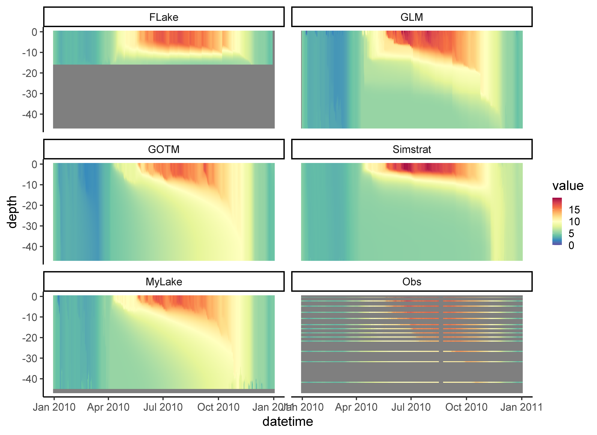

LakeEnsemblR
=====
[](https://github.com/aemon-j/LakeEnsemblR)

[](https://github.com/aemon-j/LakeEnsemblR/actions) [](https://codecov.io/github/aemon-j/LakeEnsemblR/) [](https://www.repostatus.org/#active)
<a href="url"></a>[](https://zenodo.org/badge/latestdoi/217581132)

Tools for running an ensemble of lake models using standardised input data. Lake models currently incorporated are [Freshwater Lake Model (FLake)](http://www.flake.igb-berlin.de/), [General Lake Model (GLM)](http://aed.see.uwa.edu.au/research/models/GLM/), [General Ocean Turbulence Model (GOTM)](https://gotm.net/) (lake-branch), [Simstrat](https://www.eawag.ch/en/department/surf/projects/simstrat/), and [MyLake](https://github.com/biogeochemistry/MyLake_public).

You can find example setups here: https://github.com/aemon-j/LER_examples.

## Installation
Prior to installing the package, you will need to install the packages which run the models and the tools for manipulating model data from GitHub. It is recommended to do this each time before testing to ensure all packages are up to date as there is parallel devlopment ongoing.

```{r gh-installation, eval = FALSE}
#install.packages("remotes")
remotes::install_github("GLEON/rLakeAnalyzer")
remotes::install_github("aemon-j/GLM3r", ref = "v3.1.1")
remotes::install_github("USGS-R/glmtools", ref = "ggplot_overhaul")
remotes::install_github("aemon-j/FLakeR", ref = "inflow")
remotes::install_github("aemon-j/GOTMr")
remotes::install_github("aemon-j/gotmtools")
remotes::install_github("aemon-j/SimstratR")
remotes::install_github("aemon-j/MyLakeR")
```

Following this you can install `LakeEnsemblR` from Github with:

```{r gh-installation, eval = FALSE}
# install.packages("remotes")
remotes::install_github("aemon-j/LakeEnsemblR")
```

Should you run into unexpected installation issues, please have a look at this page: https://github.com/aemon-j/LakeEnsemblR/wiki/Installation-issues

### Visualize

You can download [PyNcView](http://sourceforge.net/projects/pyncview/), a cross-platform NetCDF viewer, for viewing the NetCDF output.

## Example model run
```{r gh-installation, eval = FALSE}

# Load LakeEnsemblR
library(LakeEnsemblR)

# Copy template folder
template_folder <- system.file("extdata/feeagh", package= "LakeEnsemblR")
dir.create("example") # Create example folder
file.copy(from = template_folder, to = "example", recursive = TRUE)
setwd("example/feeagh") # Change working directory to example folder

# Set config file & models
config_file <- "LakeEnsemblR.yaml"
model <- c("FLake", "GLM", "GOTM", "Simstrat", "MyLake")

# Example run
# 1. Export settings - creates directories with all model setups and exports settings from the LER configuration file
export_config(config_file = config_file, model = model)

# 2. Run ensemble lake models
run_ensemble(config_file = config_file, model = model)

```

## Post-processing
```{r gh-installation, eval = FALSE}

# Load libraries for post-processing
library(gotmtools)
library(ggplot2)

## Plot model output using gotmtools/ggplot2
# Extract names of all the variables in netCDF
ncdf <- "output/ensemble_output.nc"
vars <- gotmtools::list_vars(ncdf)
vars # Print variables

p1 <- plot_heatmap(ncdf)
p1
# Change the theme and increase text size for saving
p1 <- p1 +
  theme_classic(base_size = 24) + 
  scale_colour_gradientn(limits = c(0, 21),
                         colours = rev(RColorBrewer::brewer.pal(11, "Spectral")))
# Save as a png file
ggsave("output/ensemble_heatmap.png", p1,  dpi = 300,width = 384,height = 280, units = "mm")

```
<!-- -->

## Plot Ensemble output
```{r gh-installation, eval = FALSE}
# Plot ensemble mean at 0.9m
model = c("FLake", "GLM", "GOTM", "Simstrat", "MyLake")
plot_ensemble(ncdf = ncdf, model = model, var = "temp", depth = 0.9)

# Load watertemp from netCDF file as a list
wtemp <- load_var(ncdf = ncdf, var = "temp", return = "list")
names(wtemp)

# Plot residual diagnostic plots
plots <- plot_resid(var_list = wtemp) # Plot residuals - returns a list of plots
names(plots) #

# Plot residuals vs. depth ("res_depth")
plots[[2]]

# Analyse the netCDF output
out <- analyse_ncdf(ncdf, model = model, spin_up = 0)
names(out)
str <- out[["strat"]]
str[str$year == 2010, ]
stats <- out[["stats"]]
stats
```
See the [vignette](https://github.com/aemon-j/LakeEnsemblR/blob/master/vignettes/LakeEnsemblR_vignette.pdf) for further examples.


How do I setup `LakeEnsemblR` for my lake?
=========================================================
Head on over to our [Wiki](https://github.com/aemon-j/LakeEnsemblR/wiki) for guides on how to set up your lake for LakeEnsemblR

How do I contribute new code back to the `LakeEnsemblR` project?
==========================================================

In order to contribute to this code, we recommend the following workflow:

1.  "fork" this repository to your own personal github account

2.  clone the github repository to your computer:

    $git clone <git@github.com:{username}/LakeEnsemblR.git>

3.  modify code or add new functionality, save the code

4.  add the repository master to a remote master called "upstream"

    $cd LakeEnsemblR

    $git remote add upstream <git@github.com:aemon-j/LakeEnsemblR.git>

5.  before pushing your changes to your repository, pull in the current version of the aemon-j master:

    $git fetch upstream

6.  merge these differences with your own "master" version:

    $git merge upstream/master

7.  push your changes to your github repository, in addition to changes made by pulling in the aemon-j master:

    $git push

8.  submit a pull request to aemon-j master using your account at github.com


Information for macOS users
=========================================================
To ensure that all model binaries work, we advise you to install the specific macOS packages (currently in a separated branch):
```
remotes::install_github("aemon-j/GLM3r", ref = "macOS")
remotes::install_github("aemon-j/FLakeR", ref = "macOS")
remotes::install_github("aemon-J/GOTMr", ref = "macOS")
remotes::install_github("aemon-j/SimstratR", ref = "macOS")
```
Unfortunately, this means your versions of GLM and Simstrat will differ compared to the ones included in the executables for Windows and Linux. GLM on macOS will be version 3.2.0a8 (most recent one on January 13, 2022), Windows/Linux use 3.1.1. The version of Simtrat for macOS is 3.0, for Windows/Linux is it 2.4.2.
